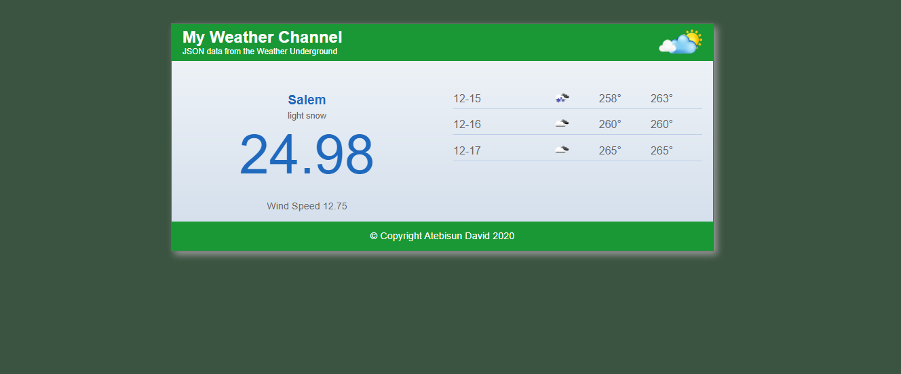

<h1>Weather Application</h1>

    

  

<h2>
    Neat Interface
</h2>

  

<h2>Live Url</h2>
<button class="bg-gray-dark"><a target="_blank" href="https://davidolaoluwa360.github.io/Weather-Application/">Visit Weather Application</a></button>
